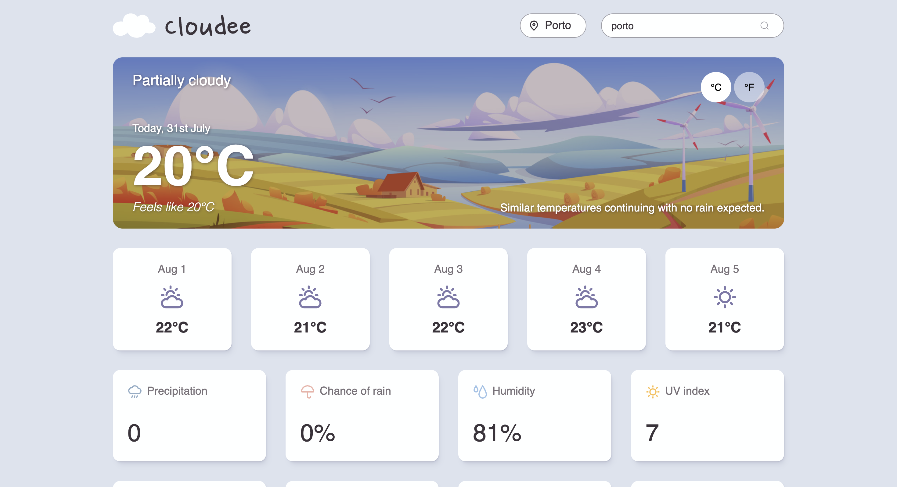

# Cloudee

A weather forecast app built with vanilla JavaScript and the [Visual Crossing](https://www.visualcrossing.com/weather-api/) API. Search any location, switch between Celsius and Fahrenheit, and see current conditions plus a five-day forecast.

Built as the [Weather App project](https://www.theodinproject.com/lessons/node-path-javascript-weather-app) from The Odin Project.

**[Live demo →](https://victoria-mali.github.io/odin-weather-app/)**

## Features

- Search weather by city or location name
- Toggle between °C and °F without re-fetching — the data is converted from what's already in memory
- Current conditions: temperature, feels-like, precipitation, chance of rain, humidity, UV index, wind, pressure, sunrise and sunset
- Five-day forecast with per-day icons
- Background image changes to match the current conditions
- Loading spinner while the request is in flight
- Specific error messages for a bad location, a rate limit, or no connection
- Staggered entrance animations, disabled automatically under `prefers-reduced-motion`
- Screen reader support: labelled controls, toggle state exposed via `aria-pressed`, and a live region announcing results as they load

## Built with

- Vanilla JavaScript (ES modules)
- [Visual Crossing Weather API](https://www.visualcrossing.com/weather-api/)
- [date-fns](https://date-fns.org/) for date formatting
- Webpack, ESLint, Prettier

## What I learned

**`fetch` doesn't reject on HTTP errors.** It only rejects when the request never completes — no connection, DNS failure, CORS block. A 400 or 500 still *resolves*, so `response.ok` has to be checked by hand. Before I understood this, my error screen only appeared because `response.json()` happened to choke on the API's plain-text error body. The error handling worked by accident.

**Throw where the error happens, catch where you can do something about it.** My API module originally caught its own errors and returned `undefined`, which threw away the reason and forced the caller to guess. Letting errors propagate up the `await` chain to the layer that owns the UI meant I could show the user what actually went wrong.

**Model UI states instead of toggling elements.** I started with a dozen `classList.add/remove` calls spread across three functions, and screens kept bleeding into each other — a stale error would sit under the spinner, or the toggle would resurrect old data over an error message. Replacing all of it with a single `data-state` attribute on `<body>`, with CSS deciding what each state looks like, made those bugs impossible rather than just fixed.

**Accessibility works best when it isn't a parallel system.** The °C/°F buttons originally tracked their active state in a CSS class, which is invisible to screen readers. Moving that state into `aria-pressed` and having the CSS style `[aria-pressed="true"]` means the visual state and the announced state are the same thing and can't drift apart.

**Date-only strings parse as UTC.** `new Date("2026-07-30")` is UTC midnight, so formatting it in a timezone behind UTC gives you the previous day. My forecast dates looked correct locally and would have been wrong for anyone in the Americas. `parseISO` treats a date-only string as local midnight, which is what a calendar date actually means.

**API responses don't guarantee every field.** Searching "Antarctica" crashed the app: it's polar night there, so Visual Crossing omits `sunrise` and `sunset` entirely rather than sending `null`. Every city I'd tested had a sunrise. Optional chaining with a sensible fallback (`weatherObj.sunrise?.slice(0, 5) ?? "—"`) handles it, and the wider lesson is that fields present in every test response still aren't promised by the contract.

## Credits

- Weather data from [Visual Crossing](https://www.visualcrossing.com/weather-api/)
- Background illustrations — [Yuliya Pauliukevich](https://www.vecteezy.com/members/klyaksun)
- Weather icons — [untitledui.com](https://www.untitledui.com/icons)
